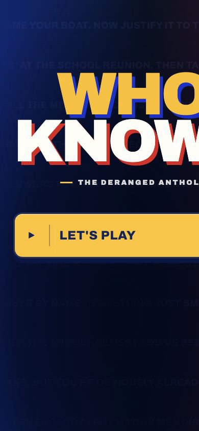
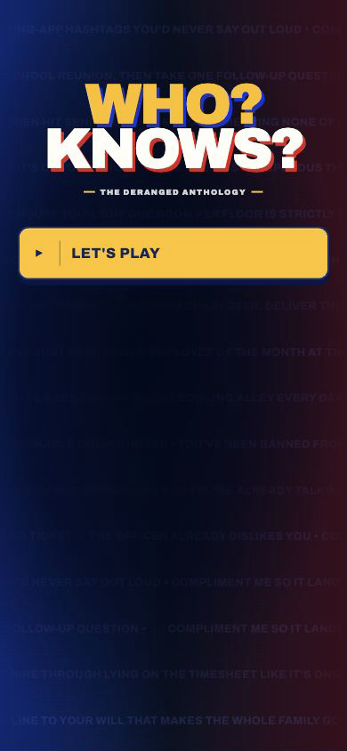
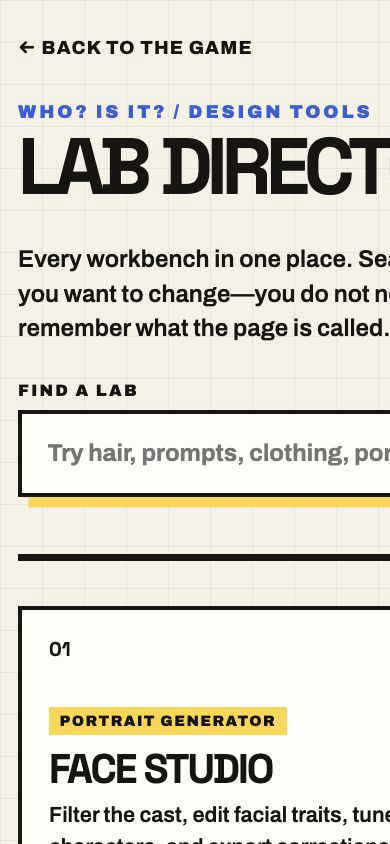
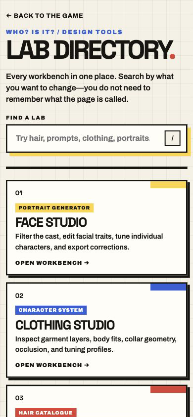
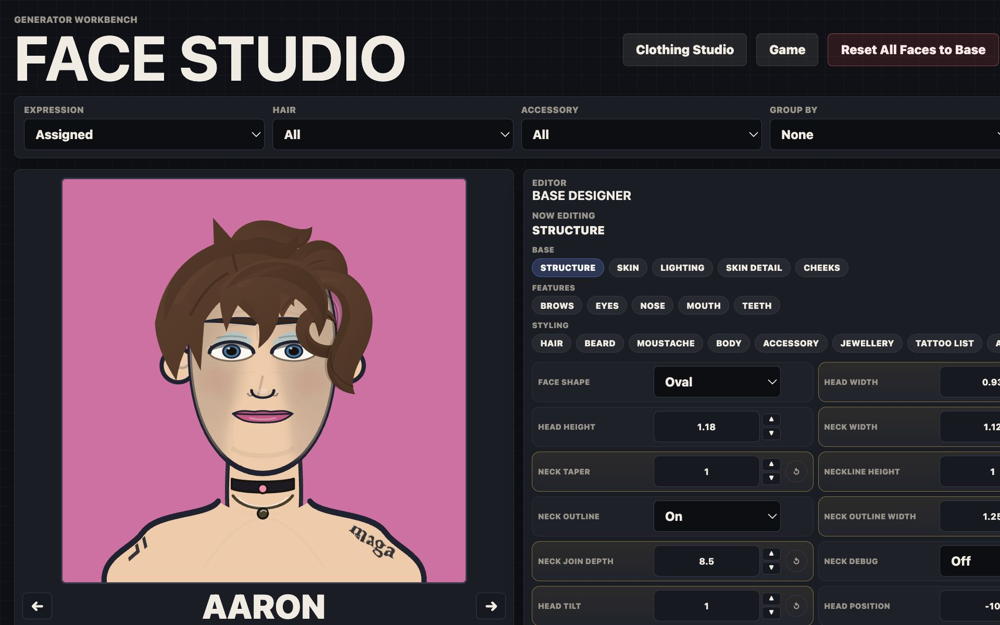
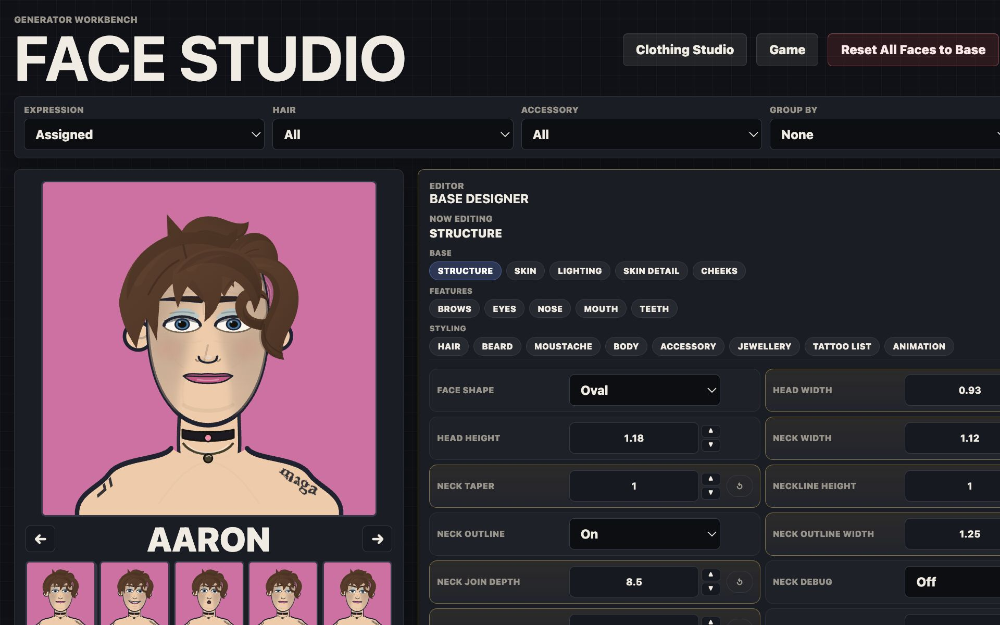

# Visual audit and decision sheet

## How to review

Each proposal is independent. Mark one box and add a note if useful:

- `[ ] KEEP` means implement the proposed “after.”
- `[ ] DECLINE` means keep the current design.
- `[ ] COMMENT` means revise the proposal first.

The user approved all three proposals on 24 July 2026. The after images below are
the reviewed mockups; the matching CSS is now part of the live game source and
has dedicated geometry regression coverage in `tests/approved-layouts.spec.js`.

## VA-01 — contain the mobile landing composition

**Priority:** critical  
**Finding:** at a 390-pixel phone width, the title, anthology line, and primary
button extend beyond the right edge. The desktop composition remains strong.

| Before | Proposed after |
| --- | --- |
|  |  |

**Suggested change:** give the mobile poster and CTA an explicit contained width,
reduce the mobile wordmark ceiling, and shorten the anthology spacing. Preserve
the colours, background, type treatment, and generous vertical breathing room.

- [x] KEEP — implemented 24 July 2026
- [ ] DECLINE
- [ ] COMMENT:

## VA-02 — make the mobile lab directory scan faster

**Priority:** high  
**Finding:** long card content widens and enlarges the mobile composition, causing
horizontal clipping and showing less than one complete workbench card.

| Before | Proposed after |
| --- | --- |
|  |  |

**Suggested change:** enforce mobile containment, reduce card minimum height from
245px to about 188px, tighten internal spacing, use a smaller mobile card title,
and clamp descriptions to two lines. This shows two complete labs plus the start
of a third while preserving the brutalist card system.

- [x] KEEP — implemented 24 July 2026
- [ ] DECLINE
- [ ] COMMENT:

## VA-03 — rebalance Face Studio toward the editor

**Priority:** medium  
**Finding:** the portrait is useful, but at desktop size it consumes roughly half
the workbench while the denser editor labels and inputs are compressed.

| Before | Proposed after |
| --- | --- |
|  |  |

**Suggested change:** use an approximately 38/62 preview/editor split, cap the
portrait around 430px, add a little panel spacing, and slightly enlarge editor
labels and numeric fields. Keep the portrait sticky and keep the existing dark
workbench visual language.

- [x] KEEP — implemented 24 July 2026
- [ ] DECLINE
- [ ] COMMENT:

## Keep as-is

These surfaces are visually strong and do not need redesign work now:

- desktop landing screen;
- desktop lab directory;
- the lab-directory colour/tag system;
- Face Studio’s overall visual language and sticky portrait concept.

## Next visual-audit pass

After this implementation:

1. Re-run functional tests. — completed 24 July 2026
2. Recapture the exact same before/after checkpoints. — completed
3. Review interaction states: hover, focus, selected, error, modal, and loading. — completed for the critical game journey
4. Continue through ruleset chooser, setup, first board, reveal, and results. — completed
5. Save approved captures as visual regression baselines. — geometry coverage added; unrelated art baselines remain pending review
