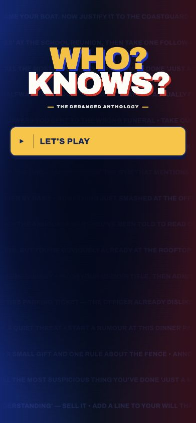
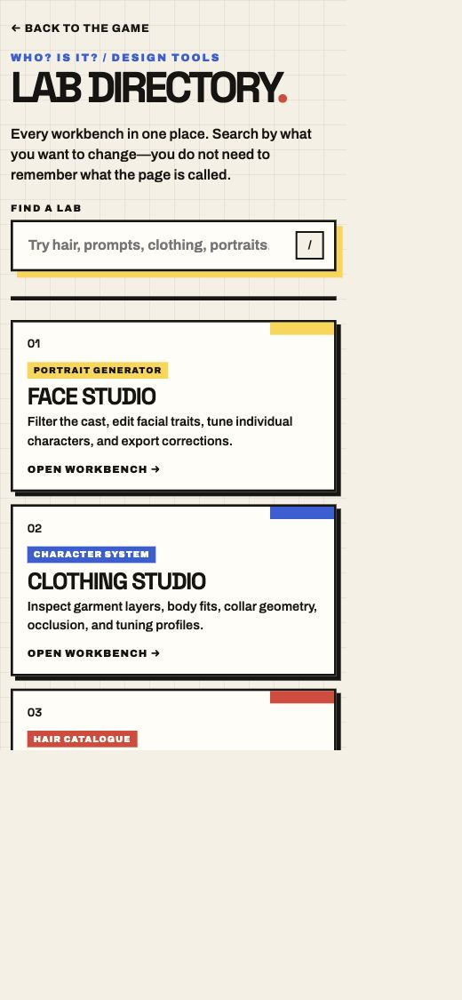
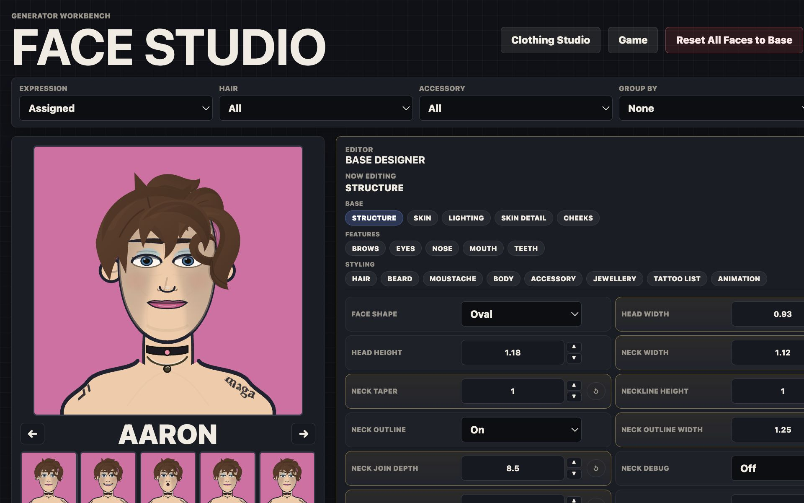
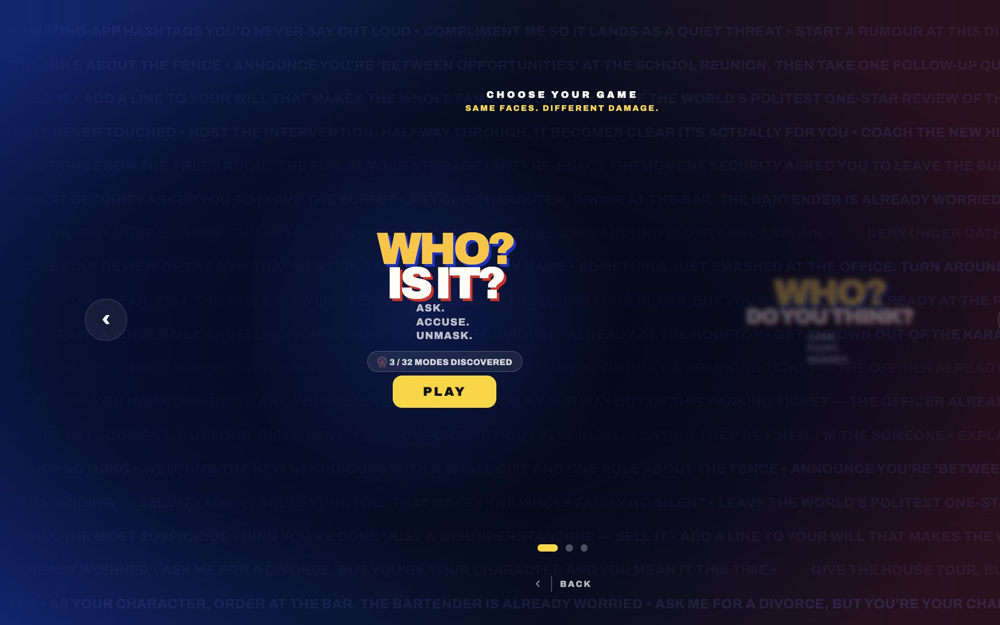
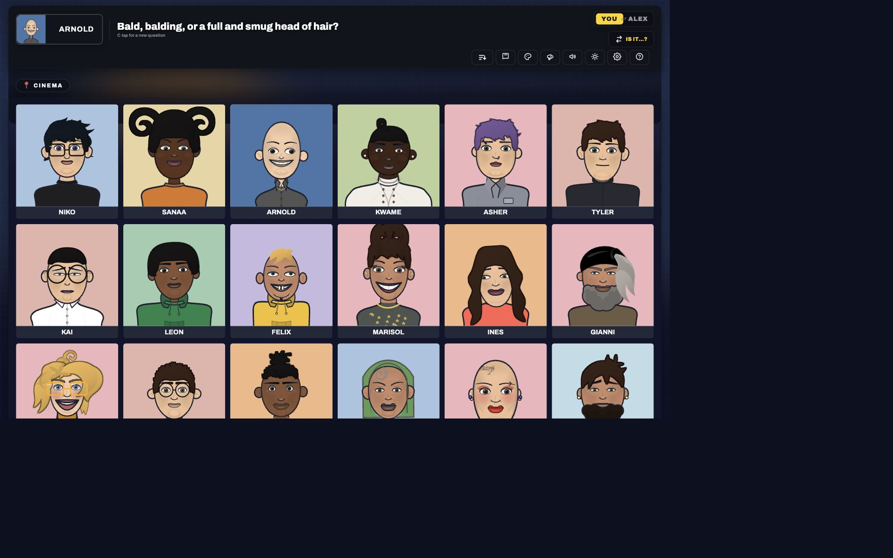
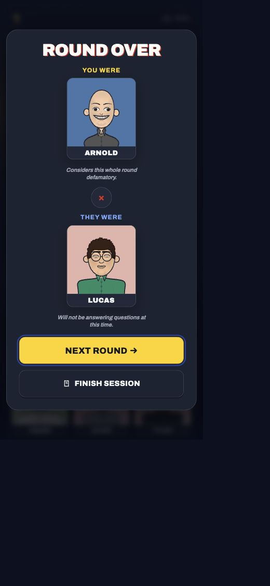

# Game review execution report

**Date:** 24 July 2026  
**Scope:** approved visual changes, directory/resource integrity, all public pages,
critical local and online rulesets, responsive layouts, and deployment readiness.

## Outcome

The approved landing, lab-directory, and Face Studio changes are implemented and
have dedicated geometry regression tests. The core game journeys are working,
all public pages load without broken references, and the deterministic rules
suite is fully green.

The repository is not completely screenshot-green. The remaining failures are
contained to visual baselines that predate the latest character/clothing art and
Face Studio hair-editor tests whose old contiguous-base assumption conflicts with
the newly imported authored layer order. No gameplay, page-load, missing-resource,
or horizontal-overflow failure remains after focused reruns.

## Implemented changes

### VA-01 — mobile landing containment

- Contained the poster, title, anthology line, CTA, and setup steps inside the
  padded phone viewport.
- Reduced the narrow-phone wordmark ceiling and anthology spacing.
- Verified at 390×844, 360×800, and 844×391.



### VA-02 — compact mobile lab directory

- Prevented horizontal overflow from card content.
- Reduced mobile card height and internal spacing.
- Clamped descriptions to two lines and kept the brutalist card treatment.
- Verified at 390×844 and 768×1024.



### VA-03 — Face Studio editor-first layout

- Changed the desktop workbench to approximately a 36/64 preview/editor split.
- Capped the portrait at 430px and gave the editor more readable control spacing.
- Preserved the single-column tablet layout and sticky desktop portrait.



### Review-discovered fixes

- Hair Studio now honours an Undo click made during the 170ms rating-card fling
  instead of silently discarding it.
- The Hair Studio persistence test now clears storage once, rather than clearing
  it again on the reload that is meant to prove persistence.
- WHO? DID YOU MAKE? scripted journey tests no longer wait for the deliberately
  shuddering donor card to become geometrically still before making a test pick.
- Added `tests/approved-layouts.spec.js` to guard the three approved layouts.

## Verification evidence

### Deterministic and integrity tests

`node --test tests/*.test.mjs`

- **73 passed, 0 failed**
- Every local HTML asset and link resolves after the directory move.
- Every CSS URL, JavaScript import, and literal public asset path resolves.
- All moved runtime entry points load from `src`.
- The lip-line regression confirms `lipLineWidth` scales the inner outline around
  an open smile.
- Clothing profiles and the latest Face Studio export are baked into runtime data.

### Public-page scan

All twelve public entry points passed on desktop, iPhone, and tablet:

- game landing;
- lab directory;
- Face Studio;
- Clothing Studio;
- Hair Studio;
- Hair Compositor;
- Genetics Lab;
- Prompt Studio;
- Gold Standard Compare;
- Audit Dashboard;
- score-health dashboard;
- simulation-range review.

The scan watches failed requests, HTTP 4xx/5xx responses, console errors, and
uncaught page errors. No broken references were found.

### Playwright review

The final full run contained **354 cases**:

- **198 passed**
- **127 intentionally skipped** by project-specific test gating
- **29 reported failures**

Focused serial reruns and two test-harness corrections cleared five of those:

- three complete WHO? DID YOU MAKE? draft/finale journeys;
- the iPhone WHO? DID YOU MAKE? overflow journey;
- the iPhone Habbo touch journey.

That leaves **24 stable review items**, all in these known buckets:

1. **6 clothing screenshot checks** — old/unstable pixel baselines following the
   latest clothing-profile changes; functional clothing-layer tests pass.
2. **15 Hair Compositor checks** — repeated across three projects: one test treats
   IDs in separate SVG image documents as colliding, and four editor tests assume
   all base layers are contiguous even though the imported authored composition
   intentionally interleaves base and placed layers.
3. **3 visual snapshots** — one focused hair-compositor image and two shared
   game-shell images reflect the newer character/art state and require visual
   approval before baseline replacement.

No baseline was silently replaced during this review.

### Manual critical journey

The in-app browser completed:

1. landing → ruleset chooser;
2. WHO? IS IT? → local setup;
3. named two-player session;
4. board render and card elimination;
5. end round → incorrect guess → reveal;
6. mobile round-result dialog;
7. finish session → confirmation → printable receipt.

The browser console remained free of errors and warnings.







## Responsive checkpoints

| Surface | Checkpoints | Result |
| --- | --- | --- |
| Landing | 360×800, 390×844, 844×391 | Pass; no horizontal overflow |
| Lab directory | 390×844, 768×1024 | Pass; cards contained and compact |
| Face Studio | 768×1024, 1280×800, 1440×900 | Pass; stacks on tablet, editor-first on desktop |
| WHO? IS IT? result | 390×844 | Pass; dialog fits viewport |
| WHO? DID YOU MAKE? draft/reveal | iPhone and tablet projects | Pass after focused rerun |
| All playable mystery boards | desktop, iPhone, tablet | Pass; no blank or overflowing boards |

## Deployment and server state

The compose file pulls a prebuilt GHCR image and does not mount the old loose
server files into `/app`. Therefore the directory reorganisation needs no manual
server-side file moves. After CI publishes the reviewed commit, the correct
manual update sequence is:

```sh
cd /opt/who-is-it
docker compose pull
docker compose up -d
docker compose ps
```

`docker compose pull latest` is invalid because `latest` is an image tag, not a
Compose service name. The service is `who-is-it`.

The local Compose configuration validates. A local image build could not be
performed because Docker Desktop was not running; this is an environment gate,
not a Dockerfile or Compose validation failure.

## Release decision

The core game and reorganised public page structure are suitable for a release
candidate. Before declaring the whole repository completely green:

1. visually review and explicitly approve or reject the 9 stale art baselines;
2. rewrite the Hair Compositor editor contract around authored mixed layer order;
3. run one real two-device production room after deployment;
4. smoke-test the deployed `/`, `/labs/`, and WebSocket room path.

Physical-device and deployed-production checks were not possible from this local
review and remain the only external validation steps.
